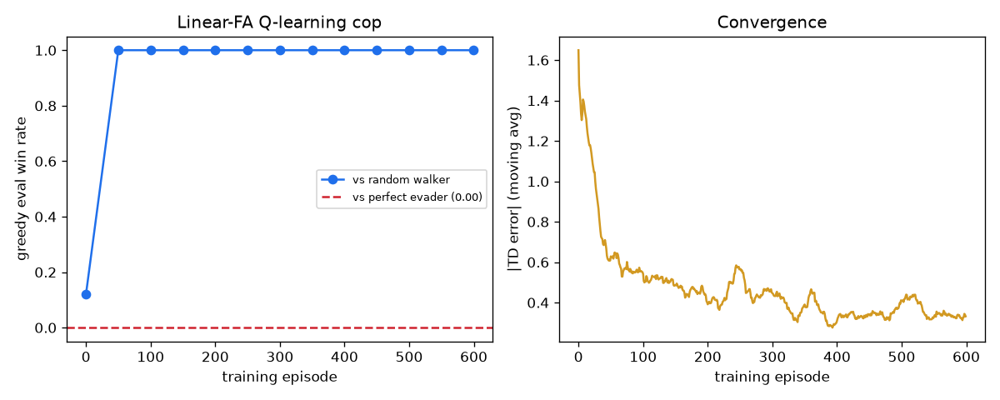
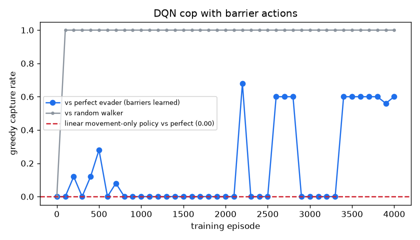
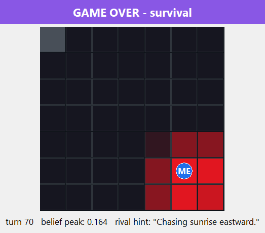
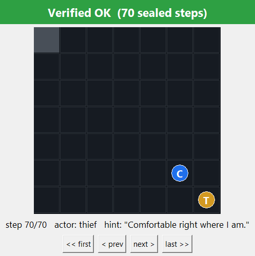

# P2P-Police — the Cop agent

Autonomous **Police (Cop)** agent for the distributed Cops-and-Robbers game, played
peer-to-peer over FastMCP with **no central server and no judge**. Integrity comes from
mathematics: a SHA-256 commit-reveal protocol seals every half-turn, and a mutual
end-of-game audit exposes any rewriting of history.

> **Sibling repository** (the Thief agent of team `anrbj666`):
> **https://github.com/alonengel/P2P-Thief**

Team: Alon Engel, Renat Karimov · Course: Orchestration of AI Agents (Univ. of Haifa)

---

## Part I — User manual

### Installation

Requirements: Python ≥3.13, [uv](https://docs.astral.sh/uv/). Two supported setups:

```bash
# A) fresh machine
git clone https://github.com/alonengel/P2P-Police && cd P2P-Police
uv sync                      # creates .venv, installs locked deps

# B) full twin-repo workspace (recommended for development)
git clone https://github.com/alonengel/P2P-Police
git clone https://github.com/alonengel/P2P-Thief   # side by side
```

Troubleshooting: `port 8802 is busy` → another peer instance is alive; stop it or
change `[network].my_port` in `config/game.toml`. `unsupported schema_version` →
your `game.json` generation is unknown to `shared/version.py` — negotiate a
supported one. Gmail errors → see `docs/DEPLOYMENT.md` (tokens expire!).

### Usage

```bash
uv run p2p-police peer                 # play one game vs the configured opponent
uv run p2p-police peer --gui           # + live local-truth view (belief heatmap)
uv run p2p-police peer --gui --gui-screenshot assets/live.png
uv run p2p-police verify-log --log results/log_<game>.json   # Verified OK / TAMPERED
uv run p2p-police replay --log results/log_<game>.json       # visual replay witness
uv run p2p-police replay --log ... --screenshot out.png      # save the witness PNG, then exit
uv run p2p-police --version

# Series / league operations (docs/LEAGUE_RUNBOOK.md; wire shape from config or --wire-shape):
uv run p2p-police peer --sub-game N [--resume|--sparring|--counted]
uv run p2p-police series-result --game-id <id> --results-dir results --results-dir ../P2P-Thief/results
uv run python scripts/league_series.py --sub-games "1,3,5" [--counted]   # our windows + auto-close
uv run python scripts/verify_pair.py <log_a.json> <log_b.json>           # third-party pair verdict

# Research reproduction (RL campaign - see Part II section 3 + PRD_08):
uv run python scripts/train_rl.py          # linear Q-learning + negative result
uv run python scripts/train_deep_rl.py     # Double-DQN cop (barrier actions)
uv run python scripts/sweep_deep_rl.py     # hyperparameter sweep (non-destructive)
uv run python scripts/run_sensitivity.py   # OAT sensitivity experiments
```

Cross-repo match on one machine: `powershell -File ../run_cross_match.ps1`.
Public play + Gmail setup: `docs/DEPLOYMENT.md`. League duties: `docs/LEAGUE_RUNBOOK.md`. Rival teams: start at `docs/ONBOARDING.md` — play against us in 30 minutes.

### Configuration

| File | Role |
|---|---|
| `config/game.json` | THE signed constitution — every agreed value (Appendix ו). Byte-identical on both sides, SHA-256-locked at negotiation; fixed values enforced at load |
| `config/game.toml` | Private: identity, ports, opponent URL, `[strategy]` brain override, `[trash_talk]` provider, `[email]` mode. JSON always overrides TOML |
| `config/rate_limits.json` | Gatekeeper triad limits per service (versioned) |
| `config/games/` | Archived per-game configs (rules 3-4) |

### Quality gates & contribution

TDD; ruff zero-violations; coverage ≥85% (branch); **≤150 code lines per file**
(`scripts/check_line_cap.py`); twin physics parity (`scripts/check_physics_parity.py`);
conventional commits; pre-commit hooks + CI enforce all of it. Five
disqualification-class book rules are additionally enforced as CI
invariants (`tests/unit/test_rule_guards.py`), and every substantive claim
in this README regenerates from a committed script into a committed
artifact — the narratives live in [docs/evidence/](docs/evidence/)
(setup / provenance / observed / what-it-does-NOT-prove, per experiment). Secrets never enter
the repo (`.gitignore` + gitleaks in CI; `.env-example` shows the shape).

---

## Part II — Academic report

### 1. The Dec-POMDP model

The race is a decentralized partially observable Markov decision process
⟨n, S, {Aᵢ}, P, R, {Ωᵢ}, O, γ⟩:

- **n = 2** — every decision is weighed against a single *rational rival*, not nature.
- **S** — cop and thief coordinates, the barrier layout, and both dynamic scent
  fields. Brute-force enumeration is infeasible — the fact that drove our
  algorithm choices (§3).
- **{Aᵢ}** — movement (orthogonal + STAY), *construction* (the cop's barriers),
  and *communication* (≤15-word hints that may lie): physics and psychology in
  one action space.
- **P** — deterministic physics that both sides must compute identically; with no
  server, P **is** the signed `game.json` + the parity-locked `domain/` code.
- **R** — the fixed scoring table (capture 20/5, survival 5/10, tie 2).
- **{Ωᵢ}** — each side observes only its own state, the rival's decaying scent
  field, and the rival's hint. Our belief map (§3) lives here.
- **O** — the observation function is **the only channel of deception**: hints
  bend O, scent cannot (it is an unforgeable byproduct of movement).
- **γ** — implicit long-horizon patience: barrier traps pay off many turns later.

### 2. FastMCP orchestration dilemmas

Each peer is simultaneously an MCP **server** (four dumb-door tools: `negotiate`,
`receive_turn`, `submit_audit`, `receive_control` → thread-safe inboxes) and a
**client** to the opponent's single known URL. Design decisions and their whys:

- **Replicated engines, lockstep application.** Both sides run the same physics
  and apply both half-turns locally; end-state digests prove convergence.
- **Persistent sessions.** Per-call MCP sessions die through tunnels
  ("Session terminated" — learned live, `docs/DEPLOYMENT.md`); one long-lived
  session per opponent, rebuilt only on failure.
- **Deadlines everywhere** (rule 6): every awaited message and every in-flight
  call is bounded; lapses route the strict turn state machine
  (WAITING→COMPUTING→COMMITTING→AWAITING_REVEAL→VERIFYING) into terminal
  TECHNICAL_LOSS instead of deadlock.
- **Gatekeeper + Orchestrator** (ch. 8/9): ALL external calls (LLM, Gmail) pass
  one doorway — token bucket, daily quota, DOS circuit breaker; the SDK facade
  is the single entry to business logic.
- **Commit order is negotiated** — an explicit agreement field, because two
  correct-but-different implementations would deadlock forever.
- **One client, two registered wire shapes** (`[network] wire_shape` /
  `--wire-shape`). The book self-contradicts: ch. 5's per-step reveal hands
  both replicated engines the rival's true position, while the formal
  model's Ωᵢ excludes it from observations (documented: ADR-0006/0007). We
  ship both readings behind one negotiated lock — the default **bookletter
  lockstep** (replicated engines, per-step reveals, `config_sha256`
  agreement) and the **reference-v3 hidden mode** (`src/p2p_police/wire/`,
  PRD_09): one commit-only TurnMessage per half-turn, the move sealed until
  the audit, the rival's position structurally absent (`OwnState` carries
  no field for it), capture claim-mediated, and the audit replayed on Board
  physics because an engine replay would false-flag honest hidden games
  (ADR-0008). Each shape speaks its own REGISTERED handshake — bookletter
  by config hash, reference-v3 by the literal flat-terms form (14-key
  `terms` + `nonce` + `signature = SHA256(canonical(terms)|nonce)`) — and
  the choice itself is a locked model: `wire_shape_sha256` over the
  published `config/wire_shape_lock.json`, refusal only when both peers
  declare and differ.
- **Hostile reality, drilled not hoped.** Chaos drills D1-D4 plus a LIVE
  tunnel kill/heal with committed JSONL evidence
  (`docs/evidence/chaos-drills.md`, `docs/evidence/drills/`);
  per-half-turn crash-resume on BOTH wire shapes (`peer --resume`; drill
  recoveries 0.045 s geometric / 0.062 s hidden, mutual audits Verified OK
  after the restart); anti-stall rails for shared-address reality —
  dedup-safe agreement re-push, bystander-tolerant pairing (a wrong-window
  or same-role greeting is "wrong game, not you": logged and tolerated
  while the one overall deadline still judges), post-settlement inbound
  refusal (a dying peer must not swallow the rival's next greeting) and a
  connect-probe orphan-port guard; and structural email interlocks — the
  league/lecturer address is reachable only when a counted game is doubly
  armed (`[email] counted = true` AND `--counted`), a send posture proves
  OAuth-token deliverability BEFORE window 1, and `--sparring` refuses a
  warm-up file carrying tuned play or an armed email path
  (`shared/interlock.py`).
- **The three classic orchestration failures** (course L09 framing) and our
  antidotes: *task duplication* — impossible, roles are disjoint by
  construction; *contradictory outputs* — replicated engines + end-state
  digests + mutual audit force one truth; *convergence failure* — strict
  turn alternation with deadlines makes unbounded loops unrepresentable.
  (MCP is the project's mandated protocol; A2A and ACP are the complementary
  standards worth knowing for lifecycle handoff and zero-trust fleets.)
- **A cross-team protocol contribution.** Reviewing a rival league team's
  draft interop protocol, we identified that per-step commits — strong
  against editing one step — leave a whole log re-forgeable offline, and
  designed the fix: a `prev`/`prev_recv` hash interlock chaining both
  sides' records into one tamper-evident DAG, making earliest divergence
  provable from the two committed logs. The draft adopted it as its flagship
  opt-in enhancement (design credited to `anrbj666`). We deliberately do NOT run
  it in counted games: it modifies the sealed record — the most
  disqualification-sensitive layer (rule 19) — for a guarantee the book does
  not require and only an opting-in opponent benefits from. The same review
  exchange surfaced the reference's byte-forms we aligned to (ADR-0004) and
  its settlement-signature quirk our conformance suite now pins.

#### Cross-team verification

- **The pair verifier** (`report/pair_verify.py`, CLI
  `scripts/verify_pair.py`) — league tooling for ANY third party: given
  both sides' log artifacts of one game it re-runs the ch. 7 replay per
  side, then cross-checks that the two sealed views describe a single game
  (same `game_uid`, same end digest, every record one side sealed
  byte-equal to what the other received — commit equality is the anchor).
  Re-verifiable on the committed twin logs of the hidden-wire game g03:

  ```bash
  uv run python scripts/verify_pair.py results/log_anrbj666-vs-anrbj666_g03.json \
    ../P2P-Thief/results/log_anrbj666-vs-anrbj666_g03.json    # overall : Verified OK
  ```

- **League record: TWO counted games, both filed, both won** (rule 52's
  minimum of two counted games vs different teams — satisfied):
  - `anrbj666-vs-imreeyal` — **90-30, 6-0**, filed 2026-08-04
    (league report `19fc9a53c7f458f9`; evidence commit
    [`67741d8`](https://github.com/alonengel/P2P-Police/commit/67741d8));
  - `anrbj666-vs-vibecode` — **75-35, 5-1**, filed 2026-08-08
    (league report `19fe2cdf49a26b0d`; evidence commit
    [`2469ff4`](https://github.com/alonengel/P2P-Police/commit/2469ff4)), after six uncounted
    friendlies that converged both stacks to zero-delta artifact diffs.
  Both series: 6/6 audits `Verified OK`, `mutual_agreement.confirmed:
  true` with byte-identical hashes across the two teams' independently
  emitted results, diversity flag earned on both first meetings. Browse
  the artifacts: working set in [results/](results/) +
  [config/games/](config/games/); immutable per-team archives with byte
  manifests in [docs/evidence/counted_games/](docs/evidence/counted_games/)
  (archive commit [`d58c340`](https://github.com/alonengel/P2P-Police/commit/d58c340)).

- **nis-yar1 pairing (2026-08-10): two clean 6-0 friendlies, cross-verified
  both directions.** After five burned attempts spanning four generations of
  rival-side infrastructure bugs — proxy response framing, restricted-shell
  egress, crash-on-first-contact, scent-lock mismatch, each diagnosed from
  our wire evidence and archived with root-cause READMEs in
  [docs/evidence/discarded-series/nisyar1-burned-attempts/](docs/evidence/discarded-series/nisyar1-burned-attempts/)
  — the first completed series swept **90-30, 6-0** (report
  `19fecaf5c92fd4d5`) and the counted-flow dress rehearsal repeated it
  (**90-30, 6-0**, report `19fece82ee5cdbd4`). Artifact bundles exchanged
  and verified after each series; `mutual_agreement.sha256`
  (`7f688ab0…`) independently recomputed by BOTH teams from their own rows;
  a shared end-state-digest recipe agreed for the upcoming counted game.
  Uncounted throughout — no rule-52 counter moved, nothing to the lecturer.
  Archives: [docs/evidence/friendlies-nisyar1/](docs/evidence/friendlies-nisyar1/).

- **Real games against a rival league team** (2026-07-24, T-protocol
  window): warm-up games over the public tunnels ran the full 35 turns to
  survival with audits **Verified OK on both sides** — the registered
  flat-terms handshake, the per-sender cadence, commit-aligned reveals
  with the rival's step-0 spec record tolerated, and the reference-exact
  audit envelope, all live; `digest_match` reports `null` between two
  per-team digest constructions (not-comparable — never falsely false). A
  full six-sub-game rehearsal of the counted format followed — roles
  alternating, truthful declarations, every audit Verified OK, the
  predicted 47-47 structural tie (`series_tie: true`), and the ONE
  series-report email fired through the gatekeeper. The rehearsal was
  mutually discarded (never counted), so its evidence lives outside the
  aggregation path by construction —
  [docs/evidence/discarded-series/](docs/evidence/discarded-series/)
  (sub-game logs + declaration + the reference-conformant series result) —
  and stays re-verifiable per side:

  ```bash
  uv run p2p-police verify-log \
    --log docs/evidence/discarded-series/log_anrbj666-vs-imreeyal_g01.json   # Verified OK
  ```

  (The byte-level PAIR cross-check is defined over two logs sealed under
  ONE schema, like our committed twin pairs; a rival half sealed under its
  own per-team schema is judged by the schema-agnostic commit criterion
  plus the derivable-rule tiers instead — never called tampered for its
  schema.)

- **Convergence day against the rival team (2026-08-03).** Four full
  six-window friendly series over the public tunnels in a single day,
  every audit **Verified OK on both sides**, the two teams' report mails
  cross-diffed after each window until the final diff returned **zero
  findings**. What converged, per the book's attached example set and the
  grader's Moodle instructions (ADR-0012 + its three addenda): a sealed
  `step_zero` record opens every log (the commit id declared through TWO
  channels — negotiate identity and sealed record — with any mismatch a
  recorded finding); commit columns are role-aware per window; the
  `final_result` carries the book-attached league fields keyed on the
  counted arming (a friendly fabricates no counted record); the ONE
  series email attaches the result file per the course chatbot's ruling;
  and `mutual_agreement.sha256` uses the reference's symmetric-outcome
  scope — **byte-identical across the two teams' independently emitted
  files, verified live**. The full negotiation record: `docs/PROMPTS.md`
  rounds 1-6.

- **The settlement guard (rule 35).** `series-result` folds sub-game logs
  (pooling BOTH role repos' results dirs) into the reference-conformant
  series result and **refuses** to emit unless every sub-game
  1..num_games is covered by a settled, audit-clean log under one
  consensus `game_uid` — wrong-window or wrong-`num_games` logs are
  excluded BY NAME, never silently, and a refused series never emails
  (`sdk/series.py`, `report/series_doc.py`, ADR-0009).

### 3. The chosen strategy

Moves are **always pure Python** (the LLM only writes banter). The shipped
pursuit brain, `strategy/police_brain.py`:

1. **Bayesian belief map** over the thief (parity-locked `domain/belief.py`):
   per turn — movement diffusion × scent likelihood × hint likelihood.
2. **Scent-grounded lie detection** (book ch. 4): a claimed region whose
   freshest trail falls below the (1−ρ)·0.9 ≈ 0.81 expectation flips the hint's
   weight — belief re-aims at the *evidence*, not the words.
3. **Barrier-aware BFS pursuit**: Manhattan distance lies once walls exist; we
   chase the true shortest path to the belief argmax.
4. **Dwell-plateau localization** (`domain/evidence.py`, PRD 10): the book's
   own update rule drives a re-emitted cell to `delta / rho`, so 21 of the 25
   kernel offsets saturate at the clamp and 4 never do — a rival that stands
   still stamps its own kernel window on the board. Reach-decoding cannot read
   it (every saturated cell decodes reach 0, so the likelihood is flat and the
   peak drifts); fitting the *shape* back inverts it to the emitter's own cell.
   Localization went from **7% exact / 2.42 cells** to **89% exact / 0.11
   cells**, and board clipping makes the fit sharpest exactly where a cornered
   rival hides. It abstains unless the shape is unambiguous — a pin is consumed
   as near-certainty. **Camping is self-reporting**, which is why our own thief
   caps consecutive stays.
5. **Surgical barriers**: spent only on a nearly-cornered thief within reach —
   quota is a resource, and a barrier on the thief's cell is an instant capture.
   The gate lives in `[strategy.trap]` and was swept, not guessed: while the
   posterior was blunt this policy fired **0.00 walls per game**, which is the
   signature of a policy starved of information rather than one badly designed.
6. **Exact endgame pre-check + info-gain steering** (`strategy/endgame.py`,
   `strategy/info_gain.py`): both had *honestly failed* their keep-gates and
   shipped OFF. Re-measured after the plateau pin sharpened the belief, both
   re-opened — the original verdicts had been about the belief, not the
   modules. They ship as a **pair**: the info-gain term is still negative alone
   (0.558 vs 0.625 baseline) and earns its place only by opening the solver's
   support gate 29% more often (230 → 296 fires), taking the pool to 0.983.

Measured: full-information pursuit captures a random thief ≥20/25 and beat the
evasion twin in 13 turns; *blind* (belief-only) pursuit still captures ≥15/25.
The blind cross-repo match flipped to thief survival — **uncertainty works as
the rulebook intends**, and our belief machinery demonstrably drives the moves.

Measured end to end over the 4-evader arena (blind cop, shipped `Perception`
pipeline, same seeds per arm — `scripts/measure_cop_strength.py`):

| arm | pool capture | heuristic | random | perfect | deep-RL |
|---|---|---|---|---|---|
| baseline (pre-PRD-10 belief) | 0.625 | 1.00 | 0.93 | 0.40 | 0.17 |
| + endgame | 0.850 | 1.00 | 1.00 | 1.00 | 0.40 |
| + info-gain alone | 0.558 | 1.00 | 0.97 | 0.00 | 0.27 |
| **shipped (both)** | **0.983** | 1.00 | 1.00 | 1.00 | 0.93 |

The `info-gain alone` row is kept in the table deliberately: it is the
component that measures *negative* in isolation and positive in combination,
and publishing only the winning row would hide the interaction that justifies
it.
**Reinforcement learning (optional path, implemented):** a linear
function-approximation Q-learner (`strategy/rl_brain.py`, features = barrier-
aware BFS geometry, TD(0), ε-greedy 0.30→0.05) trains vs a scripted
random-walker (`scripts/train_rl.py`) and converges to a **1.00 greedy win
rate** (50-game evals, dedicated eval RNG) — learned weights are
interpretable (distance −0.43: pursue; openness +0.21: avoid corners):



Against the *perfect evader*, the same trained policy captures **0% over 100
held-out games** — recorded as a first-class artifact
(`results/experiments/rl_training.json` →
`negative_result_vs_perfect_evader`) and drawn as the red line in the curve —
reproducing the classic cops-and-robbers result that one cop cannot corner a
distance-maximizing robber on an open grid. That negative result is exactly
why the shipped brain keeps its **barrier tactics** (which the RL action
space lacks) and remains the league default; the RL brain is loadable via
`[strategy] police_class = "p2p_police.strategy.rl_brain:LinearQBrain"`
(exercised end-to-end by `tests/unit/test_strategy/test_rl_brain.py`).

**Deep RL closes the loop (`strategy/rl_deep.py`):** a hand-rolled MLP
Q-network (10→tanh(12)→1, pure Python, zero new dependencies) whose action
space **includes barrier placement**, with trap-aware after-state features
(thief escape count, reachable-region size, one-exit-left flag, wall
distance, chase parity), trained **Double-DQN** style — experience replay,
frozen target network for value estimation with online-net action selection,
containment-shaped reward, best-eval checkpointing
(`scripts/train_deep_rl.py`). Result: the trap strategy that movement-only
pursuit provably lacks is **learned**, and it **matches the hand-engineered
tactics**: capture vs the perfect evader over 100 held-out games —

| Policy | Capture vs perfect evader |
|---|---|
| Linear RL, movement-only | **0.00** (provable) |
| Hand-coded PoliceBrain (engineered barriers) | **0.73** |
| Learned Double-DQN (barriers discovered) | **0.74** |



The training curve is honestly *unstable* — capture oscillates between
0.60-0.68 plateaus and 0.00 collapses (catastrophic forgetting under a
deterministic adversary), which is precisely why the shipped weights are the
**best-eval checkpoint**, not the last episode. 1.00 vs the random walker is
retained throughout (`results/experiments/deep_rl_training.json`, incl. the
hand-coded benchmark). The hand-tuned PoliceBrain stays the league default
(engineered tactics carry no training-collapse risk); the deep brain is
loadable via `[strategy] police_class = "p2p_police.strategy.rl_deep:DeepQBrain"`.
The arms race continues in the twin repo: the thief trains a Double-DQN
evader against THIS learned trap cop (replayed from copied weight data, no
cross-repo imports) and fully neutralizes it — survival 1.00 vs the
hand-coded thief's 0.49 — the classic pursuit-evasion cycle, reproduced
end-to-end inside the two-repo constraint.

**Round 2 (v3 — ensemble + partial observability):** retrained against an
adversary ENSEMBLE (perfect evader, the twin's learned counter-evader,
random walker) with **belief-noise domain randomization** — 40% of
decisions see a jittered thief cell (Chebyshev ≤2), simulating belief error
in blind games. Results over 100 held-out games each: **0.74 vs the perfect
evader retained, 0.78 with belief noise** (noise acts as a regularizer —
the policy is deployable under partial observability), 1.00 vs random —
and **0.00 vs the learned counter-evader even when trained directly
against it**. That last number is the round's finding, not its failure:
with 14 barriers, a move-forfeit cost per placement and a 35-turn clock,
the learned evader appears to sit near the game's structural optimum — the
arms race converges in the evader's favor, exactly as pursuit-evasion
theory predicts for this barrier budget.

A closing **six-config hyperparameter sweep** (`scripts/sweep_deep_rl.py`,
`results/experiments/deep_rl_sweep.json`) tested whether 0.74 was a tuning
artifact: learning rate, width and replay depth barely move the needle; a
higher exploration floor won at short budget (0.82 at 1200 episodes) but
**regressed to exactly 0.74 at full budget** and failed the coded promotion
gate. Three independent 4000-episode runs converge on 0.74 — the ceiling is
the game's structure, measured, not assumed.

**Beyond the shipped pursuit stack — three measured add-on modules:**

- `strategy/deception.py` — the self-mirror lie policy (**ON**): a second
  belief filter fed only by what we ourselves transmit estimates our own
  exposure, and we lie exactly when the lie pays — lies per game fall
  18.0 → **2.0** vs the stage-2 honesty coin while the thief's tracking
  error moves 2.36 → 1.43 (`docs/evidence/deception.md`).
- `strategy/endgame.py` — exact forced-capture solver (belief-correct
  minimax over the belief support). First measurement keep-gated it OFF
  (**0 solver fires in 160 games** — the scent-floor belief never sharpened
  to a provable support); after the dwell-plateau pin sharpened the belief
  it was **re-measured and re-opened: ships ON** — 230 fires, pool capture
  0.625 → 0.850 (§3 item 6; the original negative verdict was about the
  belief, not the module — both readings preserved in
  `docs/evidence/cop-strength.md`).
- `strategy/info_gain.py` — expected belief-entropy-reduction term blended
  into the pursuit score: still **negative alone** (0.558 vs the 0.625
  baseline) and therefore shipped **ON only as a pair** with the solver,
  whose support gate it opens 29% more often — 0.983 together;
  `[strategy.info_gain]` is never enabled without `[strategy.endgame]`.

### 4. Screenshots (mandatory evidence, from real cross-repo games)

| Live GUI — local truth only | Replay witness |
|---|---|
|  |  |
| Belief heatmap (deeper red = higher P(thief)), ME marker, turn banner, rival's hint | Green **Verified OK (70 sealed steps)** over the reconstructed game |

`verify-log` on the same log: genuine → `Verified OK`; one rewritten move →
`TAMPERED` (exit 1).

The same witness over the **hidden wire**: the reference-v3 self-play game
g03 (`results/log_anrbj666-vs-anrbj666_g03.json`, `"wire_shape":
"reference"`) replayed and re-verified — the reconstruction applies both
revealed halves on Board physics (ADR-0008), and the twin repos' two logs
of this one game pair-verify `Verified OK` (§2, Cross-team verification):


### 5. Quality mapping (ISO/IEC 25010)

Functional suitability — milestone-gated PRDs 01-09, 765 tests, branch
coverage 94.1%. Reliability — deadlines, watchdog-style FSM exits, session
rebuilds, chaos drills + crash-resume on both wire shapes,
bystander-tolerant pairing, orphan-port guard, 20-seed self-play.
Performance — template provider plays whole series at 0 LLM tokens. Security —
send-only OAuth scope, secrets outside the repo, gitleaks CI, commit-reveal
integrity, doubly-armed lecturer-address interlock. Maintainability — SDK layering, ≤150-line files, per-mechanism PRDs,
ADRs incl. documented book contradictions. Portability — uv-locked, stdlib+httpx
core. Compatibility — byte-locked shared config + golden physics vectors across
twins. Usability — one-command flows, local-truth GUI, actionable errors.

### 6. Course anchors

L09 (two agents over MCP calling external tools) → the peer architecture;
L11 (stigmergy, no central control) → the scent/belief loop; L05 (orchestrator,
skills, observability) → SDK + gatekeeper + GUI/replay; L02/L04/L08 → the
verbal-layer providers (template/Ollama/Claude/OpenRouter).

## License & credits

MIT — see [LICENSE](LICENSE). Architectural patterns studied from the official
course example repo (rmisegal/Game-P2P-Cop-Chase) under its educational terms;
where they differ, the rulebook and its Appendix ו govern.
